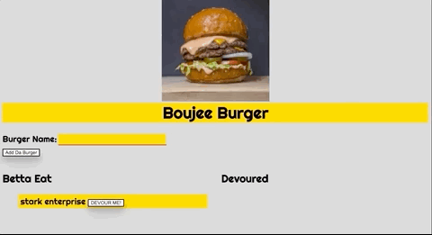

# Boujie Burger App

* Boujiee Burger is a restaurant app that lets users input the names of burgers they'd like to eat if they were at a high end classy restaurant.
Installation

## Instalation

To install this application, first, branch the Github Repo and clone the repo to your local machine. Then, you will need to install the node dependencies which can be done by running the npm install command in your terminal/bash shell.

After the dependencies have been installed, you will need to populate your MySQL database. This can be done with dummy data that is found in the sqlFiles folder. There are two files for this. First the schema.sql which will creat the database and the one table. Second, there is a seed.sql file which will populate the database with data for the one table. You can also run this application without the seed file if you want to start from a blank database after the schema.sql is added

After populating the data, you can run the command npm start or node server.js to start up the application. This application will run on PORT 8082. If this port is already opened, you can change this in the Connections.js file. Once the server is up and running, you can visit the localhost port location and start using this app!

## Usage
Once everything has been set up, the application can be launched by running the command node server.js or npm start. You will then need to visit the local host URL for the port that you have set up for this application. Once loaded in the browser, all you have to do is add new meals using the textarea, and hit submit. This will create a new meal item on the left hand table. Then you can click the fork and spoon icon to consume that item which moves it to the right hand, already devoured table.

## Instructions 

* Whenever a user submits a burger's name, your app will display the burger on the left side of the page -- waiting to be devoured.

* Each burger in the waiting area also has a "Devour Me!" button. When the user clicks it, the burger will move to the right side of the page.

## Credits
This application was completed by Curtis Pike as a project for UCLA/Trilogy's Full Stack Software Development Bootcamp.

Dependencies for this project include the node modules:

-Express: for setting up the node server

-Express Handlebars: for setting up the HTML UI

-MySQL: for setting up the database

Other credits include: Google Fonts, Font Awesome, and Bootstrap.

